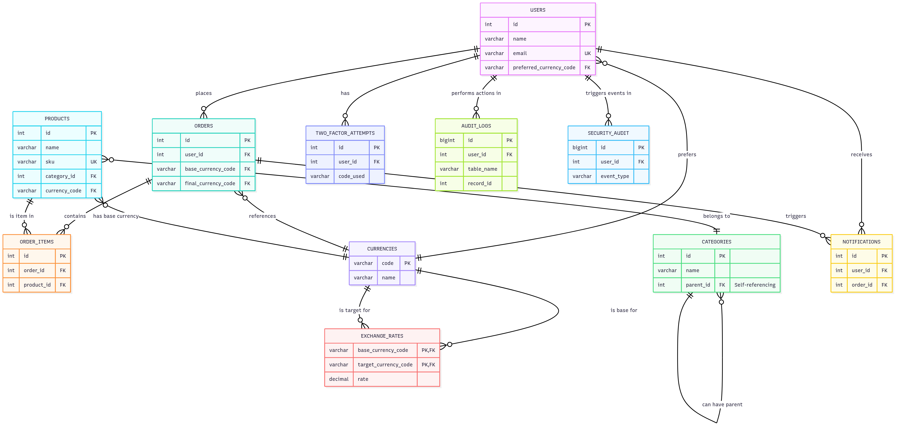

# 🛒 Grocery Store Backend - FSD

[](https://nodejs.org/)
[](https://www.typescriptlang.org/)
[](https://www.postgresql.org/)
[](https://expressjs.com/)
[](https://www.docker.com/)
[](https://opensource.org/licenses/MIT)

> A comprehensive RESTful API for managing a grocery store system with customer authentication, product management, order processing, and administrative capabilities.

## Table of Contents

- [Features](#features)
- [Tech Stack](#tech-stack)
- [Prerequisites](#prerequisites)
- [Installation & Setup](#installation--setup)
- [Configuration](#configuration)
- [Database Setup](#database-setup)
- [Running the Application](#running-the-application)
- [Testing](#testing)
- [API Documentation](#api-documentation)
- [Database Schema](#database-schema)
- [Project Structure](#project-structure)
- [Contributing](#contributing)

## ✨ Features

### 🔐 Core Functionality
- **Authentication & Authorization**: JWT-based auth with role-based access control
- **Category Management**: Hierarchical category tree structure
- **Product Management**: Full CRUD operations with bulk upload support
- **Customer Management**: Profile management and admin oversight
- **Order Management**: Complete order processing system
- **Notifications**: Mock SMS/email notifications for orders

### 🛡️ Security Features
- Password hashing with bcrypt
- JWT token authentication with refresh tokens
- Two-factor authentication (TOTP)
- Input validation and sanitization
- Role-based authorization (Customer/Admin)
- Comprehensive audit trail system
- Rate limiting for API endpoints
- Security event monitoring

### 💱 Currency Features
- Support for multiple East African currencies (KES, UGX, TZS, USD)
- Manual price setting by administrators for each currency
- User preferred currency selection
- Real-time currency formatting based on locale rules
- Price history tracking and audit trail
- Bulk price management tools

### 📊 Monitoring & Logging
- Structured application logging with Winston
- Request/response logging with Morgan
- Comprehensive audit trail for all data changes
- Security event tracking
- Performance monitoring
- Error tracking and alerting
  
## 🚀 Tech Stack

| Category | Technology |
|----------|------------|
| **Runtime** | Node.js with TypeScript |
| **Framework** | Express.js |
| **Database** | PostgreSQL |
| **Query Builder** | Knex.js |
| **Authentication** | JWT |
| **Testing** | Jest |
| **Containerization** | Docker |
| **Validation** | express-validator |
| **Logging** | Winston + Morgan |
| **2FA** | speakeasy + qrcode |
| **Currency** | Intl.NumberFormat for formatting |

## 📋 Prerequisites

- **Node.js** (v16 or higher)
- **PostgreSQL** (v12 or higher)
- **Docker & Docker Compose** (optional)
- **npm** or **yarn**

## 🔧 Installation & Setup


## Configuration


## Database Setup


## Running the Application


## Testing


## API Documentation

### Base URL
```
http://localhost:3000/api/v1
```

### Authentication
All authenticated endpoints require a JWT token in the Authorization header:
```
Authorization: Bearer <jwt_token>
```

---
### Authentication Endpoints
| Method | Endpoint | Description |
| :--- | :--- | :--- |
| `POST` | `/auth/register` | Register a new user. |
| `POST` | `/auth/login` | Log in a user and receive a JWT. |
| `POST` | `/auth/refresh` | Refresh an expired access token. |
| `GET` | `/auth/me` | Get the authenticated user's profile. |
| `POST` | `/auth/logout` | Logout and invalidate tokens. |
---

# 🔐 Two-Factor Authentication (2FA) Endpoints

| Method | Endpoint                | Description                                        |
|--------|-------------------------|-------------------------------------------
| POST   | `/auth/2fa/setup`       | Generate QR code and secret for 2FA setup 
| POST   | `/auth/2fa/verify-setup`| Confirm 2FA setup with token              
| POST   | `/auth/2fa/verify`      | Verify 2FA token during login             
| POST   | `/auth/2fa/disable`     | Disable 2FA (requires password + 2FA token)   
| GET    | `/auth/2fa/backup-codes`| Generate new backup codes                 
| POST   | `/auth/2fa/verify-backup`| Verify using backup code                 
---

### 💱 Currency Management Endpoints (Admin Only)

| Method | Endpoint                       | Description                                   |
|--------|--------------------------------|----------------------------------------
| GET    | `/admin/currencies`            | List all supported currencies          
| POST   | `/admin/currencies`            | Add new currency support               
| PUT    | `/admin/currencies/:code`      | Update currency settings               
| DELETE | `/admin/currencies/:code`      | Deactivate a currency               
| GET    | `/admin/currencies/:code/products` | List products with prices in a specific currency |
---

### Category Management (Admin Only)
| Method | Endpoint | Description |
| :--- | :--- | :--- |
| `GET` | `/categories` | List all categories. |
| `GET` | `/categories/tree` | Get the full category tree structure. |
| `GET` | `/categories/:id` | Get a single category by its ID. |
| `POST` | `/categories` | Create a new category. |
| `PUT` | `/categories/:id` | Update an existing category. |
| `DELETE` | `/categories/:id` | Delete a category. |
---
### Product Management
| Method | Endpoint                                   | Description                
|--------|---------------------------------------------|---------------------------
| GET    | `/products`                                | List all products with filtering options         |
| GET    | `/products?currency=UGX`                   | Get products with prices in specified currency   |
| GET    | `/products/:id`                            | Get single product by ID                         |
| POST   | `/products`                                | Create new product (**Admin only**)              |
| PUT    | `/products/:id`                            | Update existing product (**Admin only**)         |
| DELETE | `/products/:id`                            | Delete a product (**Admin only**)                |
| POST   | `/products/bulk-upload`                    | Bulk upload products from file (**Admin only**)  |
| POST   | `/admin/products/:id/prices`               | Set price for product in specific currency (**Admin only**) |
| PUT    | `/admin/products/:id/prices/:currency`     | Update product price in currency (**Admin only**) |
| DELETE | `/admin/products/:id/prices/:currency`     | Remove price for currency (**Admin only**)       |
| GET    | `/categories/:id/avg-price`                | Get average price for products in a category     |
---

### Customer Management
| Method | Endpoint | Description |
| :--- | :--- | :--- |
| `GET` | `/customers` | List all customers (Admin only). |
| `GET` | `/customers/profile` | Get the authenticated user's own profile. |
| `PUT` | `/customers/profile` | Update the authenticated user's own profile. |
---
### Order Management
| Method | Endpoint | Description |
| :--- | :--- | :--- |
| `GET` | `/orders` | List orders (own for customers, all for admins). |
| `GET` | `/orders/:id` | Get the details of a specific order. |
| `POST` | `/orders` | Create a new order. |
| `PUT` | `/orders/:id/status` | Update the status of an order (Admin only). |
---
### Notification Management
| Method | Endpoint | Description |
| :--- | :--- | :--- |
| `GET` | `/notifications` | List all notifications for the authenticated user. |
| `GET` | `/notifications/:id` | Get a single notification by its ID. |
| `PATCH`| `/notifications/:id/read` | Mark a specific notification as read. |
| `POST` | `/notifications/mark-all-read` | Mark all unread notifications as read. |
| `DELETE`| `/notifications/:id` | Delete a notification. |
---

# 🔍 Audit & Security Endpoints (Admin Only)

| Method | Endpoint                    | Description                                |
|--------|-----------------------------|---------------------------------------
| GET    | `/audit/logs`               | Get audit logs with filtering         
| GET    | `/audit/security-events`    | Get security event logs               
| GET    | `/audit/user/:userId`       | Get audit trail for a specific user   
---

### HTTP Status Codes
- `200` - Success
- `201` - Created
- `400` - Bad Request (validation errors)
- `401` - Unauthorized (invalid or missing token)
- `403` - Forbidden (insufficient permissions)
- `404` - Not Found
- `409` - Conflict (duplicate data)
- `500` - Internal Server Error

---

### Common Request Headers
```
Content-Type: application/json
Authorization: Bearer <jwt_token>
```

---

## 🗃️ Database Schema

### Entity Relationship Diagram



### Key Tables


#### :adult: `USERS`
Stores user information including customers and administrators.


| Column              | Type                                | Constraints                                 | Description                     
|----------------------|-------------------------------------|---------------------------------------------|--------------------------------
| `id`                | INT                                 | PRIMARY KEY, AUTO_INCREMENT                  | Unique user identifier         
| `name`              | VARCHAR(255)                        | NOT NULL                                    | User's full name                
| `email`             | VARCHAR(255)                        | UNIQUE, NOT NULL                            | User's email address            
| `password`          | VARCHAR(255)                        | NOT NULL                                    | Hashed password                 
| `phone`             | VARCHAR(20)                         | NULL                                        | Contact phone number            
| `role`              | ENUM('customer', 'admin')           | DEFAULT 'customer'                          | User role                       
| `is_active`         | BOOLEAN                             | DEFAULT TRUE                                | Account status                  
| `preferred_currency`| VARCHAR(3)                          | DEFAULT 'KES'                               | User's preferred currency       
| `two_factor_enabled`| BOOLEAN                             | DEFAULT FALSE                               | 2FA enablement status           
| `two_factor_secret` | VARCHAR(255)                        | NULL                                        | TOTP secret for 2FA             
| `backup_codes`      | TEXT                                | NULL                                        | JSON array of backup codes      
| `last_login_at`     | TIMESTAMP                           | NULL                                        | Last login timestamp            
| `created_at`        | TIMESTAMP                           | AUTO_GENERATED                              | Account creation time           
| `updated_at`        | TIMESTAMP                           | AUTO_UPDATED                                | Last update time                 
---

#### :file_folder: `CATEGORIES`
Hierarchical product categories supporting a tree structure.

| Column | Type | Constraints | Description |
| :--- | :--- | :--- | :--- |
| `id` | `INT` | `PRIMARY KEY`<br>`AUTO_INCREMENT` | Unique category identifier |
| `name` | `VARCHAR(255)` | `NOT NULL` | Category name |
| `parent_id` | `INT` | `FOREIGN KEY`<br>`NULL` | Parent category reference |
| `description` | `TEXT` | `NULL` | Category description |
| `is_active` | `BOOLEAN` | `DEFAULT TRUE` | Category status |
| `created_at` | `TIMESTAMP` | `AUTO_GENERATED` | Creation time |
| `updated_at` | `TIMESTAMP` | `AUTO_UPDATED` | Last update time |
---
### :package: `PRODUCTS` (Updated)
The price is stored in the store's base currency (e.g., KES).

| Column | Type | Constraints | Description |
| :--- | :--- | :--- | :--- |
| `id` | `INT` | `PRIMARY KEY`<br>`AUTO_INCREMENT` | Unique product identifier |
| `name` | `VARCHAR(255)` | `NOT NULL` | Product name |
| `sku` | `VARCHAR(100)` | `UNIQUE`<br>`NOT NULL` | Stock keeping unit |
| `description` | `TEXT` | `NULL` | Product description |
| `base_price_in_cents` | `INT` | `NOT NULL` | Price in the store's base currency. |
| `currency_code` | `VARCHAR(3)` | `FOREIGN KEY` | The base currency code (references `CURRENCIES`). |
| `category_id` | `INT` | `FOREIGN KEY` | Category reference |
| `is_active` | `BOOLEAN` | `DEFAULT TRUE` | Product availability |
| `stock_quantity` | `INT` | `DEFAULT 0` | Available stock |
| `created_at` | `TIMESTAMP` | `AUTO_GENERATED` | Creation time |
| `updated_at` | `TIMESTAMP` | `AUTO_UPDATED` | Last update time |
---
### :shopping_trolley: `ORDERS` (Updated)
This table stores the complete financial context of the order total.

| Column | Type | Constraints | Description |
| :--- | :--- | :--- | :--- |
| `id` | `INT` | `PRIMARY KEY`<br>`AUTO_INCREMENT` | Unique order identifier |
| `user_id` | `INT` | `FOREIGN KEY`<br>`NOT NULL` | Customer reference |
| `base_total_price_in_cents`| `INT` | `NOT NULL` | Order total in the store's base currency. |
| `base_currency_code` | `VARCHAR(3)` | `FOREIGN KEY` | The base currency code (e.g., 'KES'). |
| `final_total_price_in_cents`| `INT` | `NOT NULL` | The final amount the customer paid. |
| `final_currency_code` | `VARCHAR(3)` | `FOREIGN KEY` | The currency the customer paid with. |
| `exchange_rate_used` | `DECIMAL(15,6)`| `NOT NULL` | The conversion rate applied at purchase. |
| `status` | `VARCHAR(20)` | `DEFAULT 'pending'` | Order status |
| `delivery_address` | `TEXT` | `NULL` | Delivery address |
| `notes` | `TEXT` | `NULL` | Order notes |
| `created_at` | `TIMESTAMP` | `AUTO_GENERATED` | Order creation time |
| `updated_at` | `TIMESTAMP` | `AUTO_UPDATED` | Last update time |
---
### :package: `ORDER_ITEMS` (Updated)
Each line item records its base price and the final price paid after currency conversion.

| Column | Type | Constraints | Description |
| :--- | :--- | :--- | :--- |
| `id` | `INT` | `PRIMARY KEY`<br>`AUTO_INCREMENT` | Unique item identifier |
| `order_id` | `INT` | `FOREIGN KEY`<br>`NOT NULL` | Order reference |
| `product_id` | `INT` | `FOREIGN KEY`<br>`NOT NULL` | Product reference |
| `quantity` | `INT` | `NOT NULL` | Item quantity |
| `base_unit_price_in_cents` | `INT` | `NOT NULL` | Item's unit price in the store's base currency. |
| `base_currency_code` | `VARCHAR(3)` | `FOREIGN KEY` | The base currency code (e.g., 'KES'). |
| `final_unit_price_in_cents`| `INT` | `NOT NULL` | Unit price in the customer's currency. |
| `final_total_price_in_cents`| `INT` | `NOT NULL` | Line total in the customer's currency. |
| `final_currency_code` | `VARCHAR(3)` | `FOREIGN KEY` | The currency the customer paid with. |
| `exchange_rate_used` | `DECIMAL(15,6)`| `NOT NULL` | Conversion rate applied at the time of purchase. |
| `created_at` | `TIMESTAMP` | `AUTO_GENERATED` | Creation time |
---
#### 🏦 `CURRENCIES`
Stores information for each supported currency.

| Column | Type | Constraints | Description |
| :--- | :--- | :--- | :--- |
| `code` | `VARCHAR(3)` | `PRIMARY KEY` | The 3-letter ISO currency code. |
| `name` | `VARCHAR(255)` | `NOT NULL` | The full name of the currency. |
| `symbol` | `VARCHAR(5)` | `NOT NULL` | The currency symbol (e.g., KSh, $). |
| `is_active` | `BOOLEAN` | `DEFAULT TRUE` | Whether the currency is available for use. |
| `created_at`| `TIMESTAMP` | `AUTO_GENERATED` | Timestamp of when the record was created. |
---
#### 💱 `EXCHANGE_RATES`
Caches conversion rates fetched from an external API.

| Column | Type | Constraints | Description |
| :--- | :--- | :--- | :--- |
| `base_currency_code` | `VARCHAR(3)` | `PRIMARY KEY`<br>`FOREIGN KEY` | The currency code to convert from. |
| `target_currency_code`| `VARCHAR(3)` | `PRIMARY KEY`<br>`FOREIGN KEY` | The currency code to convert to. |
| `rate` | `DECIMAL(15, 6)`| `NOT NULL` | The conversion rate. |
| `last_updated_at` | `TIMESTAMP` | `AUTO_UPDATED` | When the rate was last updated from the provider. |
---
#### :bell: `NOTIFICATIONS`
System notifications for users and orders.

| Column | Type | Constraints | Description |
| :--- | :--- | :--- | :--- |
| `id` | `INT` | `PRIMARY KEY`<br>`AUTO_INCREMENT` | Unique notification ID |
| `user_id` | `INT` | `FOREIGN KEY`<br>`NOT NULL` | User reference |
| `order_id` | `INT` | `FOREIGN KEY`<br>`NULL` | Order reference |
| `type` | `VARCHAR(10)` | `ENUM('sms', 'email')` | Notification type |
| `recipient` | `VARCHAR(255)` | `NOT NULL` | Phone or email address |
| `message` | `TEXT` | `NOT NULL` | Notification content |
| `status` | `VARCHAR(20)` | `DEFAULT 'pending'` | Delivery status |
| `created_at` | `TIMESTAMP` | `AUTO_GENERATED` | Creation time |
| `sent_at` | `TIMESTAMP` | `NULL` | Delivery time |
---

# 🔐 TWO_FACTOR_ATTEMPTS
Tracks 2FA verification attempts for security monitoring.

| Column        | Type                         | Constraints                    | Description                  |
|---------------|------------------------------|--------------------------------|------------------------------|
| `id`          | INT                          | PRIMARY KEY, AUTO_INCREMENT    | Unique attempt identifier    |
| `user_id`     | INT                          | FOREIGN KEY, NOT NULL          | User reference               |
| `attempt_type`| ENUM('login', 'setup', 'disable') | NOT NULL                    | Type of 2FA attempt          |
| `code_used`   | VARCHAR(10)                  | NOT NULL                       | Code that was attempted      |
| `is_successful` | BOOLEAN                    | NOT NULL                       | Whether attempt succeeded    |
| `ip_address`  | VARCHAR(45)                  | NULL                           | IP address of attempt        |
| `user_agent`  | TEXT                         | NULL                           | Browser user agent           |
| `created_at`  | TIMESTAMP                    | AUTO_GENERATED                 | Attempt timestamp            |
---

# 📋 AUDIT_LOGS
Comprehensive audit trail for all system changes.

| Column         | Type                               | Constraints                 | Description                          |
|----------------|------------------------------------|-----------------------------|--------------------------------------|
| `id`           | BIGINT                             | PRIMARY KEY, AUTO_INCREMENT | Unique audit log ID                  |
| `table_name`   | VARCHAR(64)                        | NOT NULL                    | Table that was modified              |
| `record_id`    | INT                                | NOT NULL                    | ID of the modified record            |
| `action_type`  | ENUM('CREATE', 'UPDATE', 'DELETE', 'LOGIN', 'LOGOUT', 'ACCESS') | NOT NULL | Type of action              |
| `user_id`      | INT                                | FOREIGN KEY, NULL           | User who performed action            |
| `user_role`    | VARCHAR(20)                        | NULL                        | Role of user at time of action       |
| `old_values`   | JSON                               | NULL                        | Previous state for updates           |
| `new_values`   | JSON                               | NULL                        | New state for creates/updates        |
| `changed_fields` | JSON                             | NULL                        | List of changed field names          |
| `ip_address`   | VARCHAR(45)                        | NULL                        | IP address of request                |
| `user_agent`   | TEXT                               | NULL                        | Browser user agent                   |
| `session_id`   | VARCHAR(255)                       | NULL                        | User session identifier              |
| `request_id`   | VARCHAR(36)                        | NULL                        | Unique request identifier            |
| `metadata`     | JSON                               | NULL                        | Additional context                   |
| `created_at`   | TIMESTAMP                          | AUTO_GENERATED              | Audit entry timestamp                |
---

# 🛡 SECURITY_AUDIT
Security-specific events and monitoring.

| Column         | Type             | Constraints                 | Description                      |
|----------------|------------------|-----------------------------|----------------------------------|
| `id`           | BIGINT           | PRIMARY KEY, AUTO_INCREMENT | Unique security event ID         |
| `event_type`   | VARCHAR(50)      | NOT NULL                    | Type of security event           |
| `user_id`      | INT              | FOREIGN KEY, NULL           | User involved in event           |
| `email`        | VARCHAR(255)     | NULL                        | Email for failed login attempts  |
| `ip_address`   | VARCHAR(45)      | NOT NULL                    | IP address of event              |
| `user_agent`   | TEXT             | NULL                        | Browser user agent               |
| `additional_data` | JSON          | NULL                        | Event-specific data              |
| `risk_score`   | TINYINT          | DEFAULT 0                   | Risk assessment (0-100)          |
| `blocked`      | BOOLEAN          | DEFAULT FALSE               | Whether action was blocked       |
| `created_at`   | TIMESTAMP        | AUTO_GENERATED              | Event timestamp                  |
---

# 🔗 Relationships

- **Users ↔ Orders**: One-to-many – a user can have multiple orders  
- **Users ↔ Notifications**: One-to-many – user notifications  
- **Users ↔ Two Factor Attempts**: One-to-many – 2FA attempts tracking  
- **Users ↔ Audit Logs**: One-to-many – user action tracking  
- **Users ↔ Security Audit**: One-to-many – security event tracking  
- **Users ↔ Currencies**: Many-to-one – user preferred currency  

- **Categories ↔ Categories**: Self-referencing – hierarchical structure  
- **Categories ↔ Products**: One-to-many – product categorization  

- **Products ↔ Product Prices**: One-to-many – multi-currency pricing  
- **Products ↔ Order Items**: One-to-many – order line items  
- **Products ↔ Currencies**: Many-to-one – base currency  

- **Product Prices ↔ Currencies**: Many-to-one – price currency  
- **Product Prices ↔ Users**: Many-to-one – created by admin  

- **Orders ↔ Order Items**: One-to-many – order composition  
- **Orders ↔ Notifications**: One-to-many – order-related notifications  
- **Orders ↔ Currencies**: Many-to-one – order currency  

- **Order Items ↔ Currencies**: Many-to-one – item currency  

---

# 🧩 Key Features

- **Enhanced Security**: 2FA, comprehensive audit trails, security monitoring  
- **Multi-Currency Support**: Manual pricing in KES, UGX, TZS, USD with smart formatting  
- **User Management**: Customers and administrators with role-based access and currency preferences  
- **Hierarchical Categories**: Tree structure for product organization  
- **Flexible Pricing**: Products can have different prices in different currencies  
- **Inventory Tracking**: Stock quantity management  
- **Order Processing**: Complete lifecycle with status tracking and currency support  
- **Notification System**: Multi-channel (SMS/Email) notifications  
- **Audit Trail**: Complete tracking of all system changes including price updates  
- **Soft Deletes**: Logical deletion using `is_active` flags  

---

# ⚡ Database Indexes

```sql
-- Users table indexes
CREATE UNIQUE INDEX idx_users_email ON USERS(email);
CREATE INDEX idx_users_role ON USERS(role);
CREATE INDEX idx_users_two_factor_enabled ON USERS(two_factor_enabled);
CREATE INDEX idx_users_preferred_currency ON USERS(preferred_currency);

-- Currencies table indexes
CREATE UNIQUE INDEX idx_currencies_code ON CURRENCIES(code);
CREATE INDEX idx_currencies_is_active ON CURRENCIES(is_active);
CREATE INDEX idx_currencies_display_order ON CURRENCIES(display_order);

-- Categories table indexes
CREATE INDEX idx_categories_parent_id ON CATEGORIES(parent_id);
CREATE INDEX idx_categories_is_active ON CATEGORIES(is_active);

-- Products table indexes
CREATE UNIQUE INDEX idx_products_sku ON PRODUCTS(sku);
CREATE INDEX idx_products_category_id ON PRODUCTS(category_id);
CREATE INDEX idx_products_is_active ON PRODUCTS(is_active);
CREATE INDEX idx_products_base_currency ON PRODUCTS(base_currency);

-- Product Prices table indexes
CREATE INDEX idx_product_prices_lookup ON PRODUCT_PRICES(product_id, currency, is_active);
CREATE INDEX idx_product_prices_currency ON PRODUCT_PRICES(currency);
CREATE INDEX idx_product_prices_effective ON PRODUCT_PRICES(effective_from, effective_until);
CREATE INDEX idx_product_prices_created_by ON PRODUCT_PRICES(created_by);
CREATE UNIQUE INDEX idx_product_prices_active ON PRODUCT_PRICES(product_id, currency, effective_until);

-- Orders table indexes
CREATE INDEX idx_orders_user_id ON ORDERS(user_id);
CREATE INDEX idx_orders_status ON ORDERS(status);
CREATE INDEX idx_orders_currency ON ORDERS(currency);
CREATE INDEX idx_orders_created_at ON ORDERS(created_at);

-- Order Items table indexes
CREATE INDEX idx_order_items_order_product ON ORDER_ITEMS(order_id, product_id);
CREATE INDEX idx_order_items_currency ON ORDER_ITEMS(currency);

-- Notifications table indexes
CREATE INDEX idx_notifications_user_id ON NOTIFICATIONS(user_id);
CREATE INDEX idx_notifications_order_id ON NOTIFICATIONS(order_id);
CREATE INDEX idx_notifications_status ON NOTIFICATIONS(status);
CREATE INDEX idx_notifications_is_read ON NOTIFICATIONS(is_read);

-- 2FA Attempts table indexes
CREATE INDEX idx_2fa_attempts_user_id ON TWO_FACTOR_ATTEMPTS(user_id);
CREATE INDEX idx_2fa_attempts_created_at ON TWO_FACTOR_ATTEMPTS(created_at);

-- Audit Logs table indexes
CREATE INDEX idx_audit_table_record ON AUDIT_LOGS(table_name, record_id);
CREATE INDEX idx_audit_user_id ON AUDIT_LOGS(user_id);
CREATE INDEX idx_audit_created_at ON AUDIT_LOGS(created_at);
CREATE INDEX idx_audit_action_type ON AUDIT_LOGS(action_type);
CREATE INDEX idx_audit_request_id ON AUDIT_LOGS(request_id);

-- Security Audit table indexes
CREATE INDEX idx_security_audit_user_id ON SECURITY_AUDIT(user_id);
CREATE INDEX idx_security_audit_event_type ON SECURITY_AUDIT(event_type);
CREATE INDEX idx_security_audit_created_at ON SECURITY_AUDIT(created_at);
CREATE INDEX idx_security_audit_risk_score ON SECURITY_AUDIT(risk_score);


## Project Structure

```bash
grocery-store-backend/
├── src/
│   ├── config/         # Environment variables, database connection, JWT settings
│   ├── controllers/    # Handles incoming HTTP requests and sends responses
│   ├── middleware/     # Express middleware for auth, validation, errors, etc.
│   ├── models/         # Database models/entities (e.g., User, Product)
│   ├── repositories/   # Data access layer abstracting database queries
│   ├── services/       # Business logic layer
│   ├── routes/         # API route definitions
│   ├── utils/          # Helper functions and utilities
│   ├── types/          # TypeScript type definitions
│   └── app.ts          # Main application setup and server initialization
├── migrations/         # Database schema migration files
├── seeds/              # Database seed files for initial data
├── tests/              # Automated tests (unit, integration)
├── docs/               # API documentation (OpenAPI/Swagger) and diagrams
├── docker/             # Docker configuration for containerization
├── .env.example        # Example environment variables file
├── knexfile.ts         # Knex.js configuration for migrations and seeds
├── jest.config.js      # Jest test runner configuration
├── package.json        # Project dependencies and scripts
└── README.md           # Project documentation
```
---
## Environment Variables Reference


## Contributing

1. Fork the repository
2. Create a feature branch: `git checkout -b feature/amazing-feature`
3. Make your changes and add tests
4. Ensure tests pass: `npm test`
5. Commit your changes: `git commit -m 'Add amazing feature'`
6. Push to the branch: `git push origin feature/amazing-feature`
7. Open a Pull Request

### Code Standards
- Use TypeScript for all new code
- Follow ESLint configuration
- Maintain test coverage above 80%
- Write meaningful commit messages
- Update documentation for API changes

## License

This project is licensed under the MIT License - see the [LICENSE](LICENSE) file for details.

## Support

For questions or issues, please:
1. Check existing GitHub issues
2. Create a new issue with detailed description
3. Include steps to reproduce any bugs

---

**Happy coding! 🛒**
