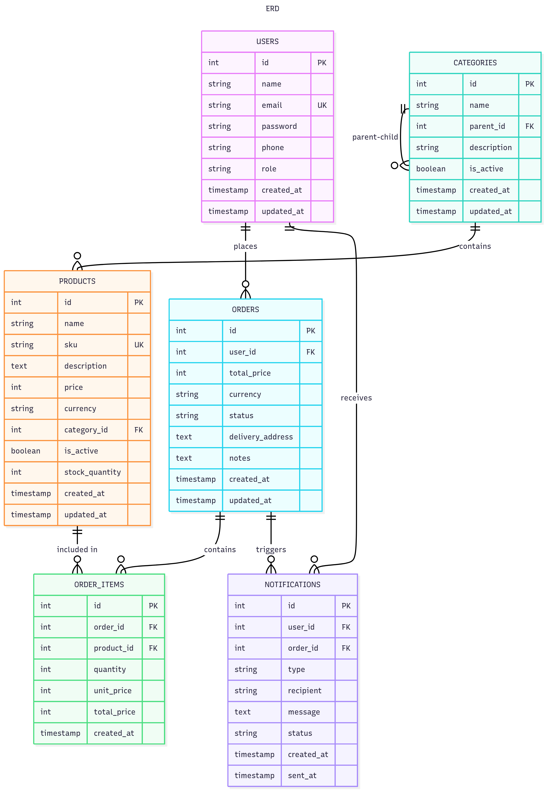

# 🛒 Grocery Store Backend - FSD

[](https://nodejs.org/)
[](https://www.typescriptlang.org/)
[](https://www.postgresql.org/)
[](https://expressjs.com/)
[](https://www.docker.com/)
[](https://opensource.org/licenses/MIT)

> A comprehensive RESTful API for managing a grocery store system with customer authentication, product management, order processing, and administrative capabilities.

## Table of Contents

- [Features](#features)
- [Tech Stack](#tech-stack)
- [Prerequisites](#prerequisites)
- [Installation & Setup](#installation--setup)
- [Configuration](#configuration)
- [Database Setup](#database-setup)
- [Running the Application](#running-the-application)
- [Testing](#testing)
- [API Documentation](#api-documentation)
- [Database Schema](#database-schema)
- [Project Structure](#project-structure)
- [Contributing](#contributing)

## ✨ Features

### 🔐 Core Functionality
- **Authentication & Authorization**: JWT-based auth with role-based access control
- **Category Management**: Hierarchical category tree structure
- **Product Management**: Full CRUD operations with bulk upload support
- **Customer Management**: Profile management and admin oversight
- **Order Management**: Complete order processing system
- **Notifications**: Mock SMS/email notifications for orders

### 🛡️ Security Features
- Password hashing with bcrypt
- JWT token authentication
- Input validation and sanitization
- Role-based authorization (Customer/Admin)

## 🚀 Tech Stack

| Category | Technology |
|----------|------------|
| **Runtime** | Node.js with TypeScript |
| **Framework** | Express.js |
| **Database** | PostgreSQL |
| **Query Builder** | Knex.js |
| **Authentication** | JWT |
| **Testing** | Jest |
| **Containerization** | Docker |
| **Validation** | express-validator |

## 📋 Prerequisites

- **Node.js** (v16 or higher)
- **PostgreSQL** (v12 or higher)
- **Docker & Docker Compose** (optional)
- **npm** or **yarn**

## 🔧 Installation & Setup


## Configuration


## Database Setup


## Running the Application


## Testing


## API Documentation

### Base URL
```
http://localhost:3000/api/v1
```

### Authentication
All authenticated endpoints require a JWT token in the Authorization header:
```
Authorization: Bearer <jwt_token>
```

---
### Authentication Endpoints
| Method | Endpoint | Description |
| :--- | :--- | :--- |
| `POST` | `/auth/register` | Register a new user. |
| `POST` | `/auth/login` | Log in a user and receive a JWT. |
| `POST` | `/auth/refresh` | Refresh an expired access token. |
| `GET` | `/auth/me` | Get the authenticated user's profile. |
---
### Category Management (Admin Only)
| Method | Endpoint | Description |
| :--- | :--- | :--- |
| `GET` | `/categories` | List all categories. |
| `GET` | `/categories/tree` | Get the full category tree structure. |
| `GET` | `/categories/:id` | Get a single category by its ID. |
| `POST` | `/categories` | Create a new category. |
| `PUT` | `/categories/:id` | Update an existing category. |
| `DELETE` | `/categories/:id` | Delete a category. |
---
### Product Management
| Method | Endpoint | Description |
| :--- | :--- | :--- |
| `GET` | `/products` | List all products with filtering options. |
| `GET` | `/products/:id` | Get a single product by its ID. |
| `POST` | `/products` | Create a new product (Admin only). |
| `PUT` | `/products/:id` | Update an existing product (Admin only). |
| `DELETE` | `/products/:id` | Delete a product (Admin only). |
| `POST` | `/products/bulk-upload` | Bulk upload products from a file (Admin only). |
| `GET` | `/categories/:id/avg-price` | Get the average price for products in a category. |
---
### Customer Management
| Method | Endpoint | Description |
| :--- | :--- | :--- |
| `GET` | `/customers` | List all customers (Admin only). |
| `GET` | `/customers/profile` | Get the authenticated user's own profile. |
| `PUT` | `/customers/profile` | Update the authenticated user's own profile. |
---
### Order Management
| Method | Endpoint | Description |
| :--- | :--- | :--- |
| `GET` | `/orders` | List orders (own for customers, all for admins). |
| `GET` | `/orders/:id` | Get the details of a specific order. |
| `POST` | `/orders` | Create a new order. |
| `PUT` | `/orders/:id/status` | Update the status of an order (Admin only). |
---
### Notification Management
| Method | Endpoint | Description |
| :--- | :--- | :--- |
| `GET` | `/notifications` | List all notifications for the authenticated user. |
| `GET` | `/notifications/:id` | Get a single notification by its ID. |
| `PATCH`| `/notifications/:id/read` | Mark a specific notification as read. |
| `POST` | `/notifications/mark-all-read` | Mark all unread notifications as read. |
| `DELETE`| `/notifications/:id` | Delete a notification. |

### HTTP Status Codes
- `200` - Success
- `201` - Created
- `400` - Bad Request (validation errors)
- `401` - Unauthorized (invalid or missing token)
- `403` - Forbidden (insufficient permissions)
- `404` - Not Found
- `409` - Conflict (duplicate data)
- `500` - Internal Server Error

---

### Common Request Headers
```
Content-Type: application/json
Authorization: Bearer <jwt_token>
```

---

## 🗃️ Database Schema

### Entity Relationship Diagram



### Key Tables


#### :adult: `USERS`
Stores user information including customers and administrators.

| Column | Type | Constraints | Description |
| :--- | :--- | :--- | :--- |
| `id` | `INT` | `PRIMARY KEY`<br>`AUTO_INCREMENT` | Unique user identifier |
| `name` | `VARCHAR(255)` | `NOT NULL` | User's full name |
| `email` | `VARCHAR(255)` | `UNIQUE`<br>`NOT NULL` | User's email address |
| `password` | `VARCHAR(255)` | `NOT NULL` | Hashed password |
| `phone` | `VARCHAR(20)` | `NULL` | Contact phone number |
| `role` | `ENUM('customer', 'admin')` | | User role |
| `is_active` | `BOOLEAN` | `DEFAULT TRUE` | Account status |
| `created_at` | `TIMESTAMP` | `AUTO_GENERATED` | Account creation time |
| `updated_at` | `TIMESTAMP` | `AUTO_UPDATED` | Last update time |

#### :file_folder: `CATEGORIES`
Hierarchical product categories supporting a tree structure.

| Column | Type | Constraints | Description |
| :--- | :--- | :--- | :--- |
| `id` | `INT` | `PRIMARY KEY`<br>`AUTO_INCREMENT` | Unique category identifier |
| `name` | `VARCHAR(255)` | `NOT NULL` | Category name |
| `parent_id` | `INT` | `FOREIGN KEY`<br>`NULL` | Parent category reference |
| `description` | `TEXT` | `NULL` | Category description |
| `is_active` | `BOOLEAN` | `DEFAULT TRUE` | Category status |
| `created_at` | `TIMESTAMP` | `AUTO_GENERATED` | Creation time |
| `updated_at` | `TIMESTAMP` | `AUTO_UPDATED` | Last update time |

#### :package: `PRODUCTS`
Product catalog with pricing and categorization.

| Column | Type | Constraints | Description |
| :--- | :--- | :--- | :--- |
| `id` | `INT` | `PRIMARY KEY`<br>`AUTO_INCREMENT` | Unique product identifier |
| `name` | `VARCHAR(255)` | `NOT NULL` | Product name |
| `sku` | `VARCHAR(100)` | `UNIQUE`<br>`NOT NULL` | Stock keeping unit |
| `description` | `TEXT` | `NULL` | Product description |
| `price` | `INT` | `NOT NULL` | Price in cents |
| `currency` | `VARCHAR(3)` | `DEFAULT 'Ksh'` | Currency code |
| `category_id` | `INT` | `FOREIGN KEY` | Category reference |
| `is_active` | `BOOLEAN` | `DEFAULT TRUE` | Product availability |
| `stock_quantity` | `INT` | `DEFAULT 0` | Available stock |
| `created_at` | `TIMESTAMP` | `AUTO_GENERATED` | Creation time |
| `updated_at` | `TIMESTAMP` | `AUTO_UPDATED` | Last update time |

#### :shopping_trolley: `ORDERS`
Customer orders with status tracking.

| Column | Type | Constraints | Description |
| :--- | :--- | :--- | :--- |
| `id` | `INT` | `PRIMARY KEY`<br>`AUTO_INCREMENT` | Unique order identifier |
| `user_id` | `INT` | `FOREIGN KEY`<br>`NOT NULL` | Customer reference |
| `total_price` | `INT` | `NOT NULL` | Total amount in cents |
| `currency` | `VARCHAR(3)` | `DEFAULT 'Ksh'` | Currency code |
| `status` | `VARCHAR(20)` | `DEFAULT 'pending'` | Order status |
| `delivery_address` | `TEXT` | `NULL` | Delivery address |
| `notes` | `TEXT` | `NULL` | Order notes |
| `created_at` | `TIMESTAMP` | `AUTO_GENERATED` | Order creation time |
| `updated_at` | `TIMESTAMP` | `AUTO_UPDATED` | Last update time |

#### :package: `ORDER_ITEMS`
Individual items within orders.

| Column | Type | Constraints | Description |
| :--- | :--- | :--- | :--- |
| `id` | `INT` | `PRIMARY KEY`<br>`AUTO_INCREMENT` | Unique item identifier |
| `order_id` | `INT` | `FOREIGN KEY`<br>`NOT NULL` | Order reference |
| `product_id` | `INT` | `FOREIGN KEY`<br>`NOT NULL` | Product reference |
| `quantity` | `INT` | `NOT NULL` | Item quantity |
| `unit_price` | `INT` | `NOT NULL` | Unit price in cents |
| `total_price` | `INT` | `NOT NULL` | Line total in cents |
| `created_at` | `TIMESTAMP` | `AUTO_GENERATED` | Creation time |

#### :bell: `NOTIFICATIONS`
System notifications for users and orders.

| Column | Type | Constraints | Description |
| :--- | :--- | :--- | :--- |
| `id` | `INT` | `PRIMARY KEY`<br>`AUTO_INCREMENT` | Unique notification ID |
| `user_id` | `INT` | `FOREIGN KEY`<br>`NOT NULL` | User reference |
| `order_id` | `INT` | `FOREIGN KEY`<br>`NULL` | Order reference |
| `type` | `VARCHAR(10)` | `ENUM('sms', 'email')` | Notification type |
| `recipient` | `VARCHAR(255)` | `NOT NULL` | Phone or email address |
| `message` | `TEXT` | `NOT NULL` | Notification content |
| `status` | `VARCHAR(20)` | `DEFAULT 'pending'` | Delivery status |
| `created_at` | `TIMESTAMP` | `AUTO_GENERATED` | Creation time |
| `sent_at` | `TIMESTAMP` | `NULL` | Delivery time |

---

#### :link: Relationships
- **Users** :left_right_arrow: **Orders**: One-to-many relationship – a user can have multiple orders.
- **Users** :left_right_arrow: **Notifications**: One-to-many relationship for user notifications.
- **Categories** :left_right_arrow: **Categories**: Self-referencing for hierarchical structure.
- **Categories** :left_right_arrow: **Products**: One-to-many relationship for product categorization.
- **Products** :left_right_arrow: **Order Items**: One-to-many relationship for order line items.
- **Orders** :left_right_arrow: **Order Items**: One-to-many relationship for order composition.
- **Orders** :left_right_arrow: **Notifications**: One-to-many relationship for order-related notifications.

#### :jigsaw: Key Features
- **User Management**: Supports both customers and administrators.
- **Hierarchical Categories**: Tree structure for product organization.
- **Inventory Tracking**: Stock quantity management.
- **Order Processing**: Complete lifecycle with status tracking.
- **Notification System**: Multi-channel (SMS/Email) notifications.
- **Audit Trail**: Timestamps for creation and updates.
- **Soft Deletes**: Logical deletion using `is_active` flags.
- **Currency Support**: Multi-currency pricing enabled.

### ⚡ Database Indexes

#### `USERS` Table
An index on the `email` column will significantly speed up user lookups and enforce uniqueness checks.

```sql
CREATE UNIQUE INDEX idx_users_email ON USERS(email);
```

---
#### `CATEGORIES` Table
Indexing `parent_id` is crucial for efficiently querying the hierarchical tree structure.

```sql
CREATE INDEX idx_categories_parent_id ON CATEGORIES(parent_id);
```

---
#### `PRODUCTS` Table
Indexes on `sku` and `category_id` will accelerate product searches and filtering by category.

```sql
CREATE UNIQUE INDEX idx_products_sku ON PRODUCTS(sku);
CREATE INDEX idx_products_category_id ON PRODUCTS(category_id);
```

---
#### `ORDERS` Table
Indexing `user_id` is essential for quickly retrieving all orders belonging to a specific customer. An index on `status` helps in filtering orders based on their state (e.g., 'pending', 'shipped').

```sql
CREATE INDEX idx_orders_user_id ON ORDERS(user_id);
CREATE INDEX idx_orders_status ON ORDERS(status);
```

---
#### `ORDER_ITEMS` Table
A composite index on `order_id` and `product_id` is highly effective for speeding up joins and lookups related to the contents of a specific order.

```sql
CREATE INDEX idx_order_items_order_product ON ORDER_ITEMS(order_id, product_id);
```

---
#### `NOTIFICATIONS` Table
Indexes on foreign keys (`user_id`, `order_id`) and the `status` column will optimize queries for retrieving notifications and processing pending ones.

```sql
CREATE INDEX idx_notifications_user_id ON NOTIFICATIONS(user_id);
CREATE INDEX idx_notifications_order_id ON NOTIFICATIONS(order_id);
CREATE INDEX idx_notifications_status ON NOTIFICATIONS(status);
```


## Project Structure

```bash
grocery-store-backend/
├── src/
│   ├── config/         # Environment variables, database connection, JWT settings
│   ├── controllers/    # Handles incoming HTTP requests and sends responses
│   ├── middleware/     # Express middleware for auth, validation, errors, etc.
│   ├── models/         # Database models/entities (e.g., User, Product)
│   ├── repositories/   # Data access layer abstracting database queries
│   ├── services/       # Business logic layer
│   ├── routes/         # API route definitions
│   ├── utils/          # Helper functions and utilities
│   ├── types/          # TypeScript type definitions
│   └── app.ts          # Main application setup and server initialization
├── migrations/         # Database schema migration files
├── seeds/              # Database seed files for initial data
├── tests/              # Automated tests (unit, integration)
├── docs/               # API documentation (OpenAPI/Swagger) and diagrams
├── docker/             # Docker configuration for containerization
├── .env.example        # Example environment variables file
├── knexfile.ts         # Knex.js configuration for migrations and seeds
├── jest.config.js      # Jest test runner configuration
├── package.json        # Project dependencies and scripts
└── README.md           # Project documentation
```

## Environment Variables Reference


## Contributing

1. Fork the repository
2. Create a feature branch: `git checkout -b feature/amazing-feature`
3. Make your changes and add tests
4. Ensure tests pass: `npm test`
5. Commit your changes: `git commit -m 'Add amazing feature'`
6. Push to the branch: `git push origin feature/amazing-feature`
7. Open a Pull Request

### Code Standards
- Use TypeScript for all new code
- Follow ESLint configuration
- Maintain test coverage above 80%
- Write meaningful commit messages
- Update documentation for API changes

## License

This project is licensed under the MIT License - see the [LICENSE](LICENSE) file for details.

## Support

For questions or issues, please:
1. Check existing GitHub issues
2. Create a new issue with detailed description
3. Include steps to reproduce any bugs

---

**Happy coding! 🛒**
